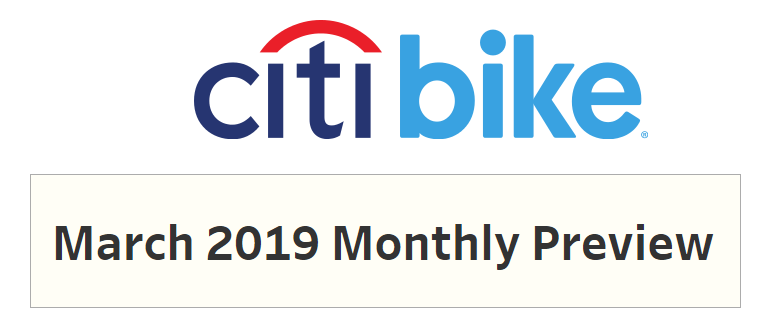
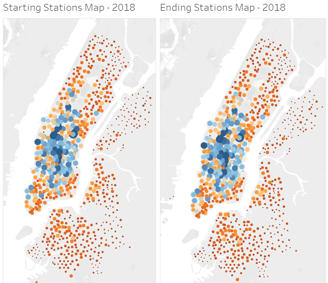
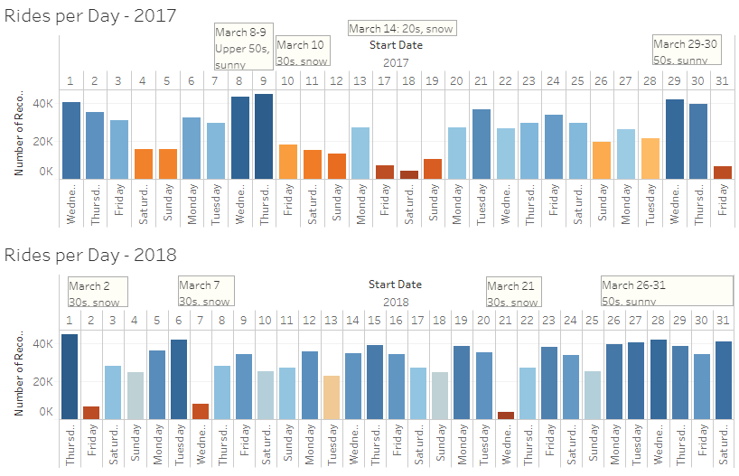

# Citi-Bikes-March-2019-Preview
link: https://public.tableau.com/profile/martin.carriel#!/vizhome/CitiBikesMarch2016-19/CitiBikeMarch2019MonthlyPreview

## Description
The [Citi Bike March 2019 Monthly Preview](https://public.tableau.com/profile/martin.carriel#!/vizhome/CitiBikesMarch2016-19/CitiBikeMarch2019MonthlyPreview) examines the past three years (2016-18) of Citi Bike data for March in order to make predictions about what to expect in the March 2019 Monthly Report. 

The analysis shows that while more bikes and stations are added consistently every year, total duration and number of trips do not experience similar linear growth. 

While rider demographics, hourly use, and station use are remarkably steady over the years, daily use can vary greatly for reasons not readily apparent in the Citi Bikes data.

For more explanation, I turned to [historical weather data for New York City](https://www.timeanddate.com/weather/usa/new-york/historic?month=3&year=2017) and found that cold or wet weather accounted for the variation from day to day. 

 

## ETL Instructions
To recreate the CSV of March data from 2016-2018:
1. Visit the repository of [downloadable Citi Bike trip data](https://s3.amazonaws.com/tripdata/index.html) and download these three files: 
* 201603-citibike-tripdata.zip
* 201703-citibike-tripdata.csv.zip
* 201803-citibike-tripdata.csv.zip
2. Extract the CSV files and place in the Resources folder.
3. Run Clean March Data.ipynb with Jupyter Lab/Notebook.
